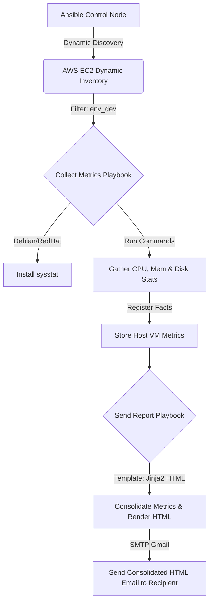

# ansible-vm-metrics-monitor

A lightweight Ansible automation project designed to dynamically discover running AWS EC2 instances, collect key virtual machine resource metrics (CPU, Memory, and Disk usage), and email a consolidated, interactive, and animated HTML health report.

---

## 📋 Table of Contents
- [Features](#-features)
- [Architecture & Workflow](#-architecture--workflow)
- [Project Structure](#-project-structure)
- [Prerequisites](#-prerequisites)
- [Configuration](#-configuration)
- [Usage](#-usage)
- [Email Template Preview](#-email-template-preview)

---

## ⚡ Features
- **Dynamic Inventory:** Automatically discovers running AWS EC2 instances in targeted regions (e.g., `ap-south-1`) filtered by tags (e.g., `Environment: dev`).
- **Metric Collection:** Installs `sysstat` if missing (supports Debian/RedHat families) and monitors:
  - **CPU Usage:** Extracted using `mpstat` (as percentage).
  - **Memory Usage:** Extracted using `free` (as percentage).
  - **Disk Usage:** Extracted using `df /` (as percentage).
- **Consolidated Animated Email Report:** Emails a responsive, styled HTML table showcasing VM health status badges (`Healthy`, `Warning`, `Critical`) and visual progress bars for each host.
- **Fail-Safe SSH:** Includes configurations to prevent SSH prompt blockages during automated runs.

---

## 🔍 Architecture & Workflow


---

## 📁 Project Structure
```text
Ansible_monitor_vms/
├── ansible.cfg                   # Ansible configuration (Inventory source, SSH overrides)
├── playbook.yml                  # Main entry point importing sub-playbooks
├── collect_metric.yml            # Playbook to target hosts, install packages, and gather facts
├── send_report.yml               # Playbook to aggregate metrics and email HTML report
├── groups_vars/
│   └── all.yml                   # SMTP & recipient email configurations (gitignored in production)
├── inventory/
│   └── aws_ec2.yml               # AWS EC2 Dynamic Inventory plugin setup
└── templates/
    └── report_email_animated.html.j2 # Jinja2 HTML template with animated progress bars & status badges
```

---

## 🛠️ Prerequisites
Before running the playbooks, ensure your environment meets the following requirements:

1. **Ansible Control Node:**
   - Ansible installed (version `2.9+` recommended).
   - Python packages: `boto3` and `botocore` (required for AWS EC2 dynamic inventory integration).
2. **AWS Setup:**
   - Configure AWS CLI credentials on your control node (or use IAM roles) with permissions to read EC2 instances.
3. **SMTP Credentials:**
   - A Gmail account with an **App Password** created (do not use your primary password) for authentication.

---

## ⚙️ Configuration

1. **Configure Inventory (`inventory/aws_ec2.yml`):**
   Update region filter or instance tags to match your environment:
   ```yaml
   regions:
     - ap-south-1
   filters:
     tag:Environment: dev
     instance-state-name: running
   ```

2. **Configure SMTP Variables (`groups_vars/all.yml`):**
   Provide your specific sender/receiver and App Password credentials:
   ```yaml
   smtp_server: "smtp.gmail.com"
   smtp_port: 587
   email_user: "your-sender-email@gmail.com"
   email_pass: "your-gmail-app-password"
   alert_recipient: "your-receiver-email@gmail.com"
   ```

---

## 🚀 Usage

Execute the entire suite of playbooks by running the main playbook:

```bash
ansible-playbook playbook.yml
```

Alternatively, you can run individual parts:

**Collect Metrics Only:**
```bash
ansible-playbook collect_metric.yml
```

**Send Report Only (uses existing registered facts):**
```bash
ansible-playbook send_report.yml
```

---

## 📧 Email Template Preview
The consolidated HTML report generated by `report_email_animated.html.j2` includes:
- **Consolidated Health Status Badge:** A single status column (`Healthy`, `Warning`, or `Critical`) dynamically computed for each VM based on its highest utilized resource.
- **Animated Progress Bars & Percentages:** Displays metrics cleanly with values alongside themed progress bars for CPU (Rose Red), Memory (Blue), and Disk (Emerald Green).
- **Interactive Hostnames:** Hostnames link directly to the target system's address for quick administrative access.
